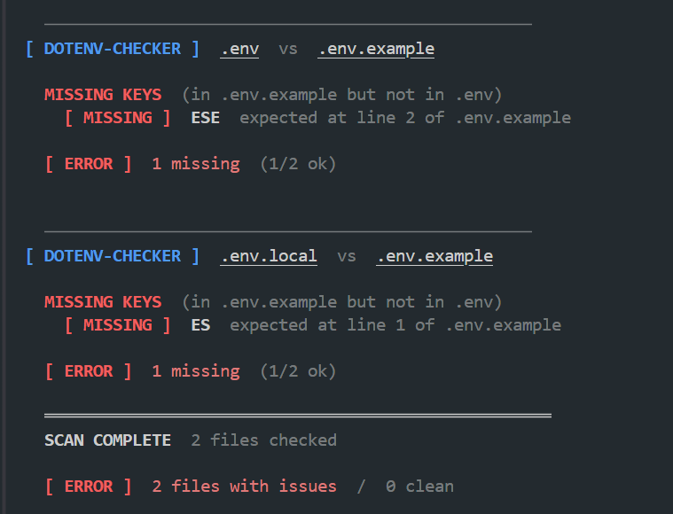
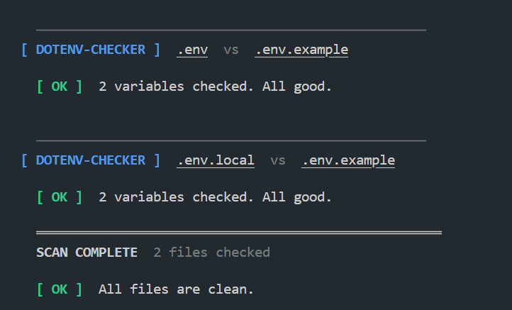
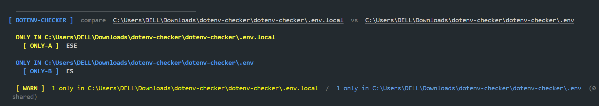

<div align="center">


# dotenv-checker

**Stop shipping broken environments.**  
Catch missing, empty, and undocumented `.env` variables before they cause issues.


</div>

---

## Why

A teammate clones the repo. You renamed a variable last week. The app starts, fails silently, and nobody knows why.

`dotenv-checker` runs in one command and tells you exactly what's wrong.

---

## Features

- Scans your **entire project** for every `.env*` file automatically
- Detects **missing**, **empty**, and **undocumented** keys
- Compares **any two env files** directly: staging vs production, local vs CI
- Zero config, no setup required
- 1 dependency (`chalk`)

---

## Installation

```bash
git clone https://github.com/tanguykonan/dotenv-checker.git
cd dotenv-checker
npm install -g .
```

`dotenv-checker` is then available anywhere in your terminal.
NOTE: You can delete the repository from your computer.

---

## Usage

### Scan the whole project *(default)*

Recursively finds every `.env*` file, pairs each one with its `.env.example`, and reports all issues at once.

```bash
dotenv-checker
dotenv-checker --dir ./backend
```

<div align="center">
  
  <br/><br/>
  
</div>

---

### Compare two env files directly

No `.env.example` needed. Useful for diffing environments or branches.

```bash
dotenv-checker --compare .env.staging .env.production
```

<div align="center">
  
</div>

---

### Check a specific pair

```bash
dotenv-checker --env .env.local --example .env.example
```

---

## Options

| Flag | Default | Description |
|---|---|---|
| `--dir <path>` | `.` | Root directory for project scan |
| `--env <path>` | `.env` | Path to your env file |
| `--example <path>` | `.env.example` | Path to your example file |
| `--compare <A> <B>` | - | Compare two env files side by side |
| `--verbose`, `-v` | false | Also show valid / shared keys |
| `--help`, `-h` | - | Show usage |

---

## Exit codes

| Code | Meaning |
|---|---|
| `0` | No issues found |
| `1` | One or more issues detected |
| `2` | File not found or invalid arguments |

Works well in CI pipelines: exit code `1` blocks the pipeline when `.env` is out of sync.

```yaml
# GitHub Actions
- name: Check .env consistency
  run: dotenv-checker --env .env.ci --example .env.example
```

---

## Project structure

```
dotenv-checker/
├── src/
│   ├── cli.js         # entry point, argument parsing, mode selection
│   ├── parser.js      # reads and decodes .env files into a Map
│   ├── checker.js     # compares two Maps and categorizes keys
│   ├── reporter.js    # formats and prints results with chalk
│   └── scanner.js     # recursively finds all .env* files in the project
├── tests/
│   └── test.js        # test suite for parser and checker
└── assets/            # screenshots used in this README
```

---

## License

MIT - [tanguykonan](https://github.com/tanguykonan)